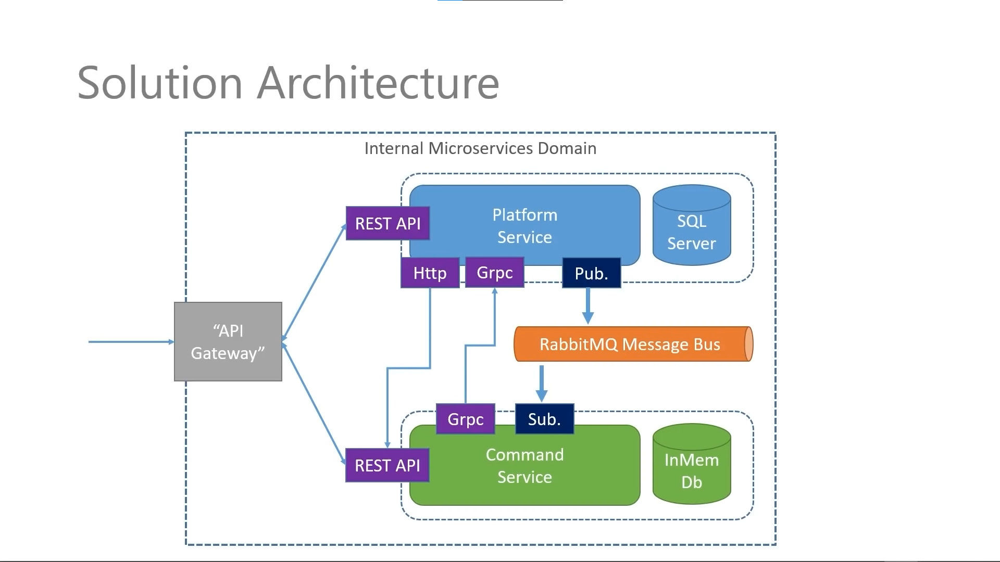
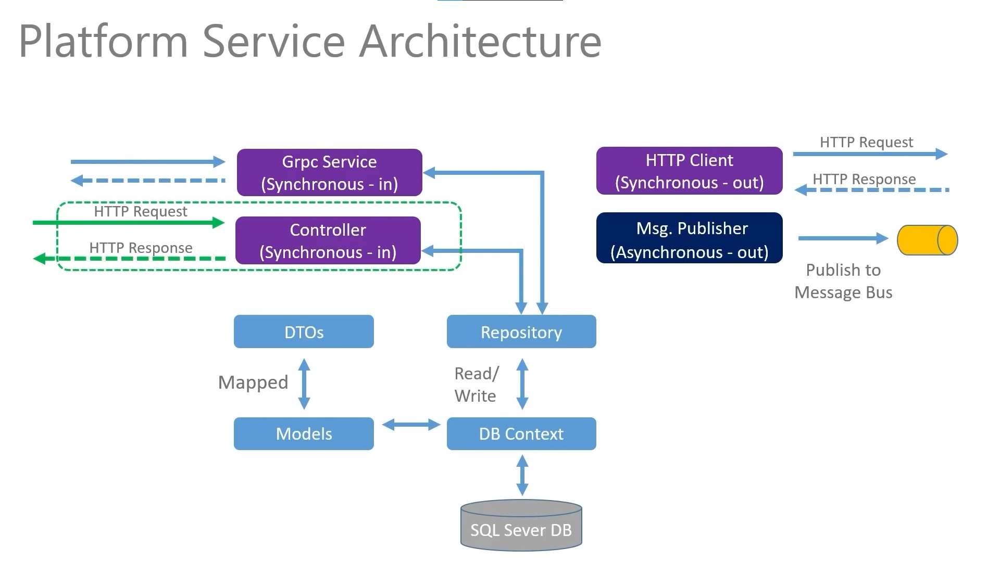
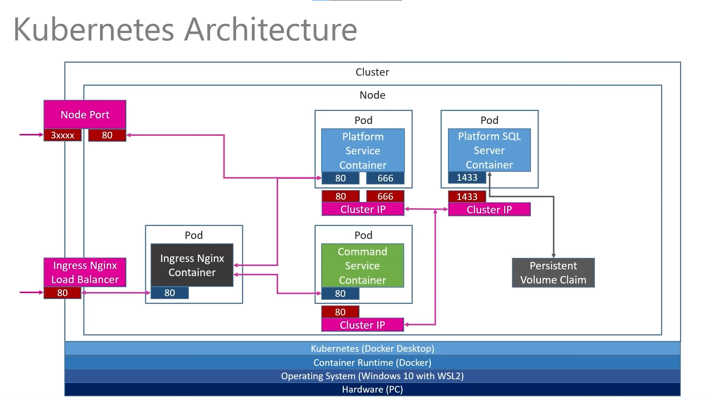

# Microservice Registry Application

This is a simple but powerful and scalable microservices-based platform for managing and sharing platforms and their relevant commands. This application is built using C# and .NET, Kubernetes, Docker, RabbitMQ, and gRPC for service to service communication, providing a robust and scalable solution for platform and command management.

## Overview
The Microservice Registry Application consists of two primary services, a Platform Service and a Commands Service, that communicate with each other and external clients through a RESTful API Gateway.

## Services

#### Platform Service

The Platform Service serves as the central component for managing platforms. It offers the following features:

- Add and view different platforms in the registry.
- Uses a SQL Server database with a persistent volume claim to store platform information.
- Exposes API endpoints for adding, viewing, and managing platforms.
- Publishes platform creation events to the RabbitMQ message bus.

#### Commands Service

The Commands Service complements the Platform Service and is responsible for managing commands associated with the registered platforms. Key features include:

- Add and manage relevant commands and their descriptions.
- Utilizes an in-memory database for quick access to command data.
- Subscribes to the RabbitMQ message bus to receive platform creation events.
- Updates its own database when new platforms are created.

## Communication

The two services communicate with each other using gRPC and RabbitMQ, enabling efficient data exchange between the Platform Service's SQL Server database and the Commands Service's in-memory database.

#### Asynchronous Messaging with RabbitMQ

The application employs RabbitMQ to enable asynchronous communication between services. Whenever a new platform is created in the Platform Service, it publishes a "Platform_Created" event to the message bus. The Commands Service is subscribed to the message bus and asynchronously receives these events, updating its database with the new platform information.

#### Synchronous Messaging with gRPC

gRPC contract is built between both services with the Platform service made as the server and the Commands service as the client. It handles seeding already existing platforms to our in memory database for the Commands Service. Also, accounts for duplicate platforms and ignores them during seeding.

## Deployment

The Microservice Registry Application is deployed in a Kubernetes cluster with Docker. Here are some key deployment details:

- Each service has its own deployment and its own pod.
- The Platform Service uses a SQL Server database with a persistent volume claim.
- The application's external endpoint is accessible through an Ingress controller managed by Nginx and Load Balancer for high availability.
- Services within the cluster communicate with each other through ClusterIP.